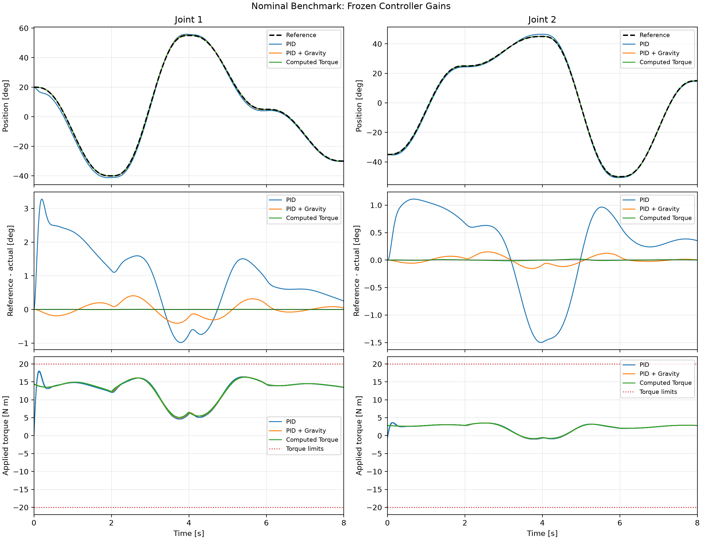

# Planar Two-DOF Robot Arm: Tracking and Robustness

A reproducible Python simulation study comparing independent-joint PID, PID with gravity compensation, and computed torque control (CTC) for a rigid robot arm moving in a vertical plane.

## Results

| Metric | PID | PID + Gravity | CTC |
|---|---:|---:|---:|
| Nominal overall joint RMSE (degrees) | 1.115037 | 0.152634 | 0.004992 |
| Force-disturbance recovery delay (s) | 1.555 | 0.087 | 0.263 |

CTC tracks most accurately under nominal conditions. Gravity-compensated PID recovers fastest under the specified force-disturbance criterion: endpoint error at or below 10 mm for at least 0.5 s after force removal. These findings apply to the frozen gains and tested conditions; they are simulation results, not hardware measurements.



See the [accepted datasets](results/README.md), [research questions and advance predictions](RESEARCH_CHARTER.md), and [Lagrangian derivation](notebooks/09_lagrangian_derivation.md).

## Setup

Clone the repository (the provenance checks require Git history), then run:

```shell
git clone https://github.com/juancaimaixin/robot2dof-2-link-.git
cd robot2dof-2-link-
conda env create -f environment.yml
conda activate robot2dof
python -m pip install -e .
python -m pytest -p no:cacheprovider -q
python -m ruff check --no-cache src tests experiments
```

Install the Conda environment first: `pyproject.toml` does not declare the scientific dependencies. The environment file records the project dependency versions. Quarto is not required for this published source tree.

## Run Experiments

```shell
python experiments/run_nominal_benchmark.py
python experiments/run_payload_benchmark.py
python experiments/run_model_uncertainty_benchmark.py
python experiments/run_disturbance_benchmark.py
```

Each benchmark writes a new timestamped directory under `results/`, including trajectories, configurations, metadata, metrics, and a comparison plot. New outputs are ignored by Git by default; the four accepted datasets remain versioned.

Frozen gains and the original 900-candidate tuning record are in `results/tuning_search.json`. Benchmarks reuse those gains. `experiments/run_tuning_search.py` writes to that same file; preserve the accepted record before running a new tuning study. Do not retune against held-out benchmark results.

## Repository Structure

```text
src/robot2dof/        Robot models, controllers, simulation, tuning, and metrics
tests/               Numerical and behavioral regression tests
experiments/         Benchmark, plotting, and symbolic verification scripts
results/             Frozen tuning record and 42 accepted evaluation runs
notebooks/           Lagrangian derivation and equation figure
RESEARCH_CHARTER.md   Research questions, predictions, and experimental scope
environment.yml      Scientific Python environment
pyproject.toml       Package and test configuration
run.ps1              Optional Windows launcher
```

## Scope

The benchmarks cover nominal tracking, unknown payloads, controller-model errors, and endpoint force disturbances. Large payloads can combine model mismatch with torque saturation. The deterministic simulations do not establish hardware performance or statistical confidence intervals; friction, backlash, delay, and sensor noise are not modeled.
