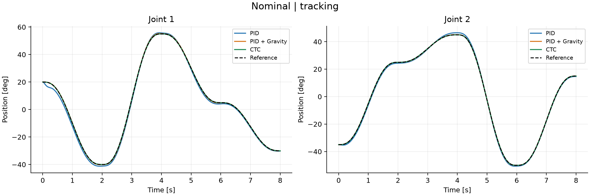
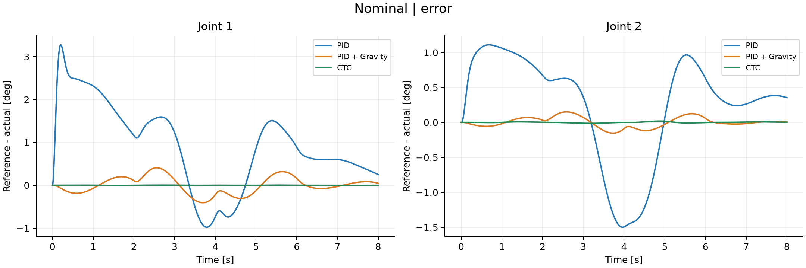
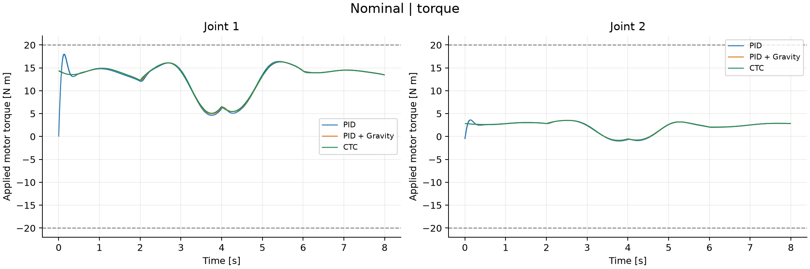
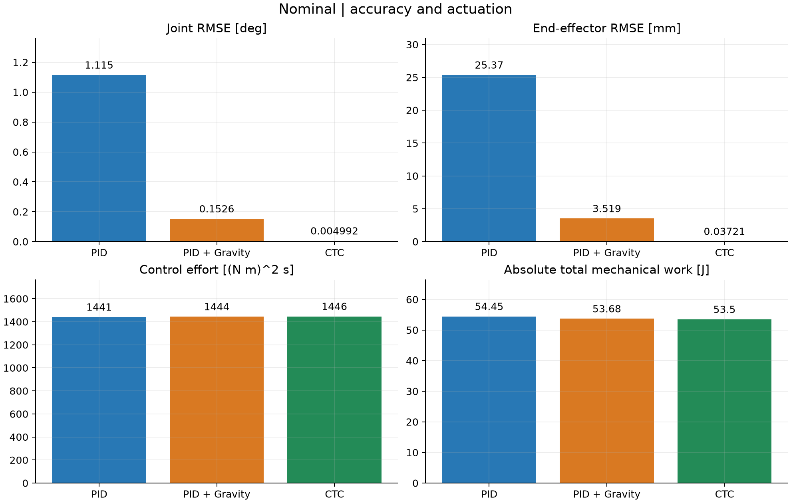
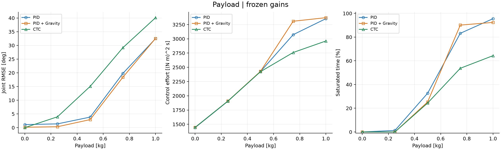
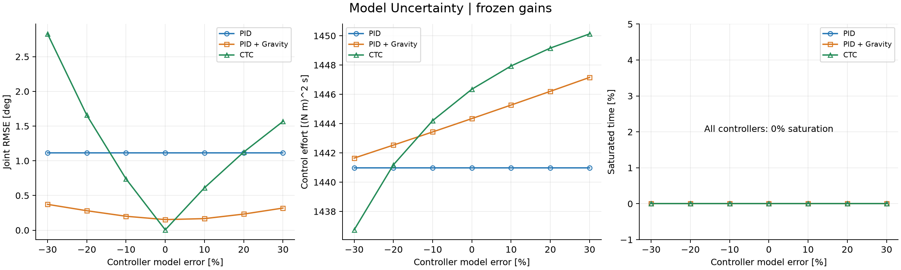
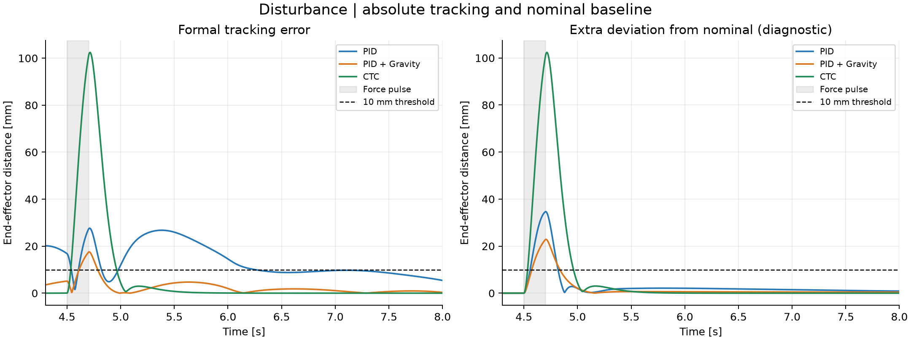
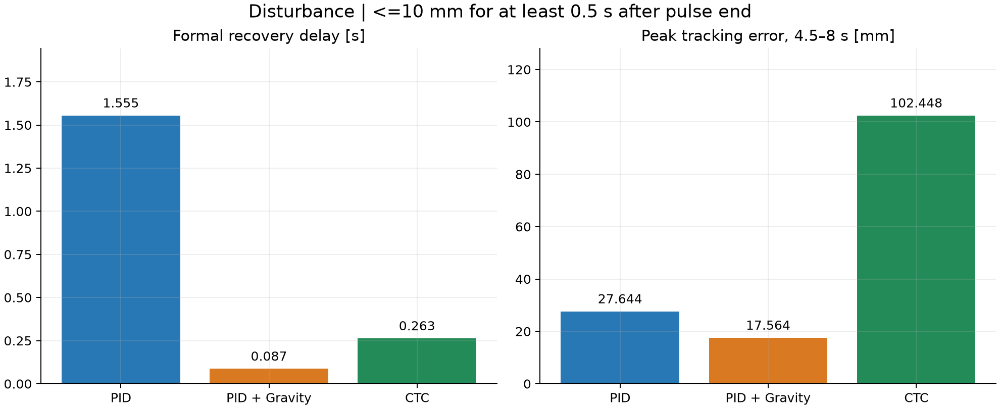

# Stage 21: Data Analysis and Core Figures

This page and all values are generated by analyze.py from frozen runs: 42 deterministic simulations, without statistical error bars or confidence intervals.

## Metric Definitions

Joint RMSE includes all 8001 samples and both joints; end-effector error is Euclidean distance. Control effort is the integral of squared actual motor torque, in (N.m)^2.s, not energy. Absolute mechanical work is the integral of absolute total joint power, in J, and does not represent electrical consumption. Saturation is measured by the duration of intervals with either joint saturated.

Recovery is measured from 4.7 s: error must stay at or below 10 mm for at least 0.5 s. Unconfirmed recovery is identified explicitly; non-disturbance runs show a dash. Peak columns cover 0-8 s; post-disturbance peaks over 4.5-8 s are stored separately in the CSV.

The normalized column is scenario RMSE / the same controller nominal RMSE. CTC has a very small nominal baseline; ratios alone cannot rank different controllers. A zero denominator leaves the value blank.

## All Runs

|Experiment|Parameter|Controller|Joint RMSE (deg)|EE RMSE (mm)|Full-run peak (mm)|Effort ((N.m)^2s)|Absolute work (J)|Saturation (%)|Recovery (s)|RMSE / own nominal|
|---|---|---|---:|---:|---:|---:|---:|---:|---:|---:|
|nominal|—|pid|1.115037|25.366|54.107|1440.970|54.452|0.000|—|1.000|
|nominal|—|pid_gravity|0.152634|3.519|7.221|1444.343|53.683|0.000|—|1.000|
|nominal|—|computed_torque|0.004992|0.037|0.101|1446.349|53.497|0.000|—|1.000|
|payload|0.0|pid|1.115037|25.366|54.107|1440.970|54.452|0.000|—|1.000|
|payload|0.0|pid_gravity|0.152634|3.519|7.221|1444.343|53.683|0.000|—|1.000|
|payload|0.0|computed_torque|0.004992|0.037|0.101|1446.349|53.497|0.000|—|1.000|
|payload|0.25|pid|1.380694|31.104|67.972|1903.538|61.930|1.275|—|1.238|
|payload|0.25|pid_gravity|0.338827|7.785|15.167|1907.240|61.077|0.000|—|2.220|
|payload|0.25|computed_torque|3.967051|28.539|41.753|1905.316|60.636|0.000|—|794.669|
|payload|0.5|pid|3.851948|81.910|249.523|2425.652|78.095|32.625|—|3.455|
|payload|0.5|pid_gravity|2.936610|60.548|213.262|2429.336|74.634|25.275|—|19.240|
|payload|0.5|computed_torque|15.061124|68.595|163.053|2423.344|74.340|24.375|—|3017.002|
|payload|0.75|pid|19.789138|401.421|780.065|3072.730|110.315|83.188|—|17.748|
|payload|0.75|pid_gravity|18.388365|371.861|825.579|3308.659|61.719|90.112|—|120.474|
|payload|0.75|computed_torque|29.155920|153.646|394.210|2759.973|96.669|53.688|—|5840.433|
|payload|1.0|pid|32.490911|642.289|1246.316|3353.373|73.415|95.513|—|29.139|
|payload|1.0|pid_gravity|32.552774|635.600|1229.850|3370.874|57.820|92.375|—|213.273|
|payload|1.0|computed_torque|40.108152|264.565|586.778|2961.621|119.356|64.312|—|8034.353|
|model_uncertainty|-0.3|pid|1.115037|25.366|54.107|1440.970|54.452|0.000|—|1.000|
|model_uncertainty|-0.3|pid_gravity|0.372387|8.519|15.129|1441.644|53.950|0.000|—|2.440|
|model_uncertainty|-0.3|computed_torque|2.828458|38.008|52.026|1436.743|54.064|0.000|—|566.589|
|model_uncertainty|-0.2|pid|1.115037|25.366|54.107|1440.970|54.452|0.000|—|1.000|
|model_uncertainty|-0.2|pid_gravity|0.280691|6.442|12.492|1442.531|53.862|0.000|—|1.839|
|model_uncertainty|-0.2|computed_torque|1.657619|22.424|30.459|1441.183|53.832|0.000|—|332.050|
|model_uncertainty|-0.1|pid|1.115037|25.366|54.107|1440.970|54.452|0.000|—|1.000|
|model_uncertainty|-0.1|pid_gravity|0.200772|4.629|9.857|1443.430|53.773|0.000|—|1.315|
|model_uncertainty|-0.1|computed_torque|0.739656|10.056|13.572|1444.202|53.647|0.000|—|148.166|
|model_uncertainty|0.0|pid|1.115037|25.366|54.107|1440.970|54.452|0.000|—|1.000|
|model_uncertainty|0.0|pid_gravity|0.152634|3.519|7.221|1444.343|53.683|0.000|—|1.000|
|model_uncertainty|0.0|computed_torque|0.004992|0.037|0.101|1446.349|53.497|0.000|—|1.000|
|model_uncertainty|0.1|pid|1.115037|25.366|54.107|1440.970|54.452|0.000|—|1.000|
|model_uncertainty|0.1|pid_gravity|0.166760|3.797|7.584|1445.268|53.623|0.000|—|1.093|
|model_uncertainty|0.1|computed_torque|0.611066|8.335|11.144|1447.938|53.415|0.000|—|122.407|
|model_uncertainty|0.2|pid|1.115037|25.366|54.107|1440.970|54.452|0.000|—|1.000|
|model_uncertainty|0.2|pid_gravity|0.232168|5.248|10.190|1446.205|53.581|0.000|—|1.521|
|model_uncertainty|0.2|computed_torque|1.125612|15.360|20.461|1449.159|53.387|0.000|—|225.479|
|model_uncertainty|0.3|pid|1.115037|25.366|54.107|1440.970|54.452|0.000|—|1.000|
|model_uncertainty|0.3|pid_gravity|0.318798|7.198|13.659|1447.155|53.546|0.000|—|2.089|
|model_uncertainty|0.3|computed_torque|1.566751|21.361|28.369|1450.128|53.377|0.000|—|313.847|
|disturbance|—|pid|1.103720|25.197|54.107|1483.010|56.519|0.000|1.555|0.990|
|disturbance|—|pid_gravity|0.176402|3.997|17.564|1483.627|55.571|0.000|0.087|1.156|
|disturbance|—|computed_torque|2.237485|15.139|102.448|1487.029|56.070|0.000|0.263|448.207|

## Interpretation

With these frozen gains, model-compensating controllers have smaller nominal tracking errors. Payload and model-error curves show that nominal superiority does not guarantee superiority under mismatch. Controllers were tuned separately, so differences cannot be attributed solely to adding one compensation term.

Formal disturbance recovery is affected by both baseline tracking error and additional deviation. The right panel of Figure 7 is diagnostic and does not replace the formal criterion in Figure 8. Unknown external force is not compensated by nominal CTC; nominal accuracy does not establish the strongest disturbance rejection.

Conclusions apply only to the frozen gains, held-out trajectory, payload/error grids, and force protocol. They do not predict hardware performance. The model excludes friction, backlash, delay, and sensor noise.

## Core Figures

### 01_nominal_tracking: Nominal | tracking

### 02_nominal_error: Nominal | error

### 03_nominal_torque: Nominal | torque

### 04_nominal_metrics: Nominal | accuracy and actuation

### 05_payload: Payload | frozen gains

### 06_model_uncertainty: Model Uncertainty | frozen gains

### 07_disturbance_response: Disturbance | absolute tracking and nominal baseline

### 08_disturbance_metrics: Disturbance | <=10 mm for at least 0.5 s after pulse end

